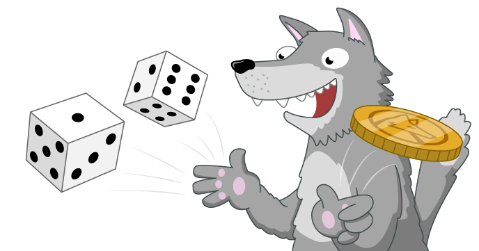

# c3-wolfram-coin-and-dice

Find the project online at [projects.raspberrypi.org/en/projects/c3-wolfram-coin-and-dice](https://projects.raspberrypi.org/en/projects/c3-wolfram-coin-and-dice)

## Resources
For solutions and project materials, see [en/resources](https://github.com/raspberrypilearning/c3-wolfram-coin-and-dice/tree/master/en/resources)

## Contributing
See [CONTRIBUTING.md](CONTRIBUTING.md)

## Licence
 See [LICENSE.md](LICENSE.md)