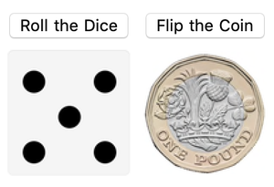

## Introduction

In this project, you are going to make an automatic coin flipper and a dice roller. You'll be working with graphics, interactivity and randomness.

### What you will make

--- print-only ---

--- /print-only ---

--- collapse ---
---
title: What you will need
---
### Hardware

+ A computer: desktop, laptop, or a Raspberry Pi

### Software

+ Wolfram Language — this is available for free on the Raspberry Pi as part of NOOBS

--- /collapse ---

--- collapse ---
---
title: What you will learn
---

+ Choosing items randomly from a list
+ Creating graphics in the Wolfram Langauge
+ Using `Manipulate` in the Wolfram Language

If you have never used the Wolfram Language before, follow [this guide](https://projects.raspberrypi.org/en/projects/getting-started-with-mathematica). You'll need to look at Starting Mathematica and Programming in Mathematica. If you are using the web browser version of Wolfram, you only need to look at Programming in Mathematica.

--- /collapse ---

--- collapse ---
---
title: Additional information for educators
---

If you need to print this project, please use the [printer-friendly version](https://projects.raspberrypi.org/en/projects/project-name/print){:target="_blank"}.

[Here is a link to the resources for this project](http://rpf.io/project-name-go).

--- /collapse ---
