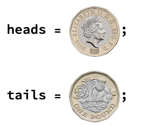

## Create a coin flipper

First, you will build the coin flipper. The coin flipper is fairly simple: you should be able to press a button and randomly return either heads or tails.

--- task ---

First, you need images of both sides of a coin. Right-click on each of these images and save them to your desktop. Drag the images from your desktop into your notebook in Wolfram. If you are using a desktop version of Wolfram, you can drag and drop the images straight into your notebook.

You could also search on the internet for images of a different coin, maybe in a different currency.


Assign each coin a variable name: `heads` for the heads side of the coin, and `tails` for the tails side of the coin. Put a `;` after each line of code to suppress the output, otherwise the image of the coin will print whenever you run this code.



--- /task ---

You need a list of the coin options (heads or tails).

Lists start with `{` and end with `}`, and each element is separated by a `,`.

--- task ---
Make a list which contains your coin options.

Assign this list to the variable name `coinOptions`.


--- /task ---

To be able to flip the coin and randomly get either heads or tails, you can use `RandomChoice`.

```
RandomChoice[coinOptions]
```

--- task ---
Now, it would be useful to have a button for the user to press to flip the coin. Use the following lines of code to create a button which randomly outputs either heads or tails.

```
Button["Flip Coin", 
 Print[RandomChoice[coinOptions]]]
```
--- /task ---

You might notice that every time you press the button, the new output appears underneath the old output. It would be better to replace the old output with the new output when you press the button.

You can use `Dynamic` to do this. `Dynamic` displays the updated value, so every time you press the button and rerun the code, `Dynamic` will display the new value and replace the old value.

--- task ---
Use `Dynamic` to create a button. You can use the following lines of code. 

```
coin = heads;
Button["Flip Coin", 
 coin = RandomChoice[coinOptions]]
Dynamic[coin]
```
--- /task ---

Replace your old button with the new Dynamic button.
