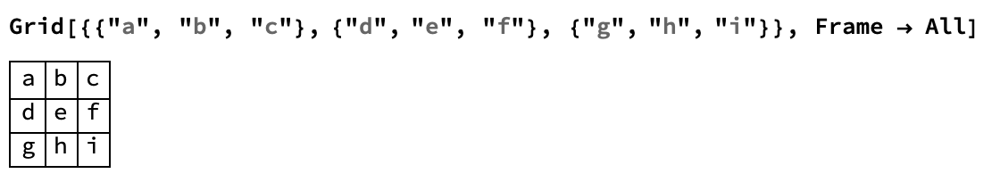

## Making the dice
Now we will build the dice roller.

Each face on a die is made up of nine boxes, and the boxes which correspond to the number are filled in with a circle.

We can construct this using `Grid` and `Graphics`.
Look at this example of `Grid`.



`Grid` is made up of a list of lists, where each list becomes a row in the grid.

We make a circle using `Graphics` and `Disk`. 


--- task ---

Create a variable of a `Graphics[Disk[]]` called dot.

```dot = Graphics[Disk[]]```

--- /task ---

Let's look at how we could create the number 1 on a die. A first attempt might be:


We also want to make all the boxes inside the grid the same size. We can do this by specifying `ItemSize`, which ensures that the disk and the `Null` gaps are all the same size.


Perfect! Let's make it look a little more like a die by removing the `Frame`


`Panel` gives a very nice grey background around objects, so let's use `Panel` to improve the appearance of our die.


--- task ---

Construct each of the six sides of the die, and assign each side to a variable name.


```
dot = Graphics[Disk[]];

one = Panel[
  Grid[{{Null, Null, Null}, {Null, dot, Null}, {Null, Null, Null}}, 
   ItemSize -> {2, 2}]];
   
two = Panel[
  Grid[{{dot, Null, Null}, {Null, Null, Null}, {Null, Null, dot}}, 
   ItemSize -> {2, 2}]];
   
three = Panel[
  Grid[{{dot, Null, Null}, {Null, dot, Null}, {Null, Null, dot}}, 
   ItemSize -> {2, 2}]];

four = Panel[
  Grid[{{dot, Null, dot}, {Null, Null, Null}, {dot, Null, dot}}, 
   ItemSize -> {2, 2}]];


five = Panel[
  Grid[{{dot, Null, dot}, {Null, dot, Null}, {dot, Null, dot}}, 
   ItemSize -> {2, 2}]];

six = Panel[
  Grid[{{dot, dot, dot}, {Null, Null, Null}, {dot, dot, dot}}, 
   ItemSize -> {2, 2}]];
   
```
--- /task ---

--- task ---
Make a list which contains all of the sides of the die, and assign it the variable name `diceOptions`.

```
diceOptions = {one, two, three, four, five, six}
```

--- /task ---

In order to roll the dice, just like we did earlier to create a coin flipper, all we have to do is set up a `RandomChoice` between the six options in the list.

--- task ---
Use `RandomChoice` to randomly pick one of the sides in the list.

```
RandomChoice[diceOptions]
```

--- /task ---

--- task ---
Take the code you wrote to create a button for the coin flipper, and alter it to roll the die instead.


--- hints ---
--- hint ---
Remember that you created a dynamic button for your coin-flipper by creating a button and then marking the `coin` variable as dynamic, like this:

```
coin = heads;
Button["Flip Coin", 
 coin = RandomChoice[coinOptions]]
Dynamic[coin]
```
--- /hint ---
--- /hints ---
--- /task ---