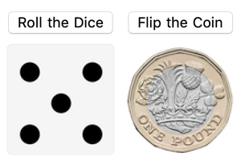

## Build an interface

Now that you have two buttons, one which flips a coin and one which rolls a die, you can combine them into an interface.

You can use `Grid` to make the interface.

Look at this example of `Grid`.


`Grid` is made up of a list of lists, where each list becomes a row in the grid.

--- task ---

Make a `Grid` with two rows.
The first row should be the buttons you created.
The second row should be the `Dynamic` updated result.

```
Grid[{{dice = one;
Button["Roll the Dice",dice = RandomChoice[diceOptions]],
coin = heads;
Button["Flip the Coin", coin = RandomChoice[coinOptions]]},
{Dynamic[dice], Dynamic[coin]}}]
 ```
--- /task ---

Congratulations, you have built a coin flipper and a dice roller tool!


