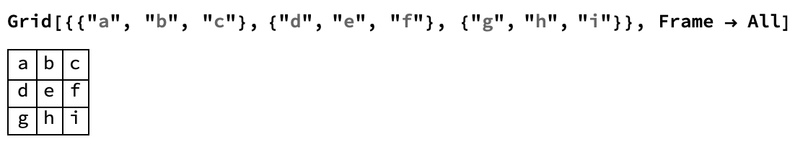

## Building An Interface

Now that we have two buttons, one which flips a coin and one which rolls a die, we can combine them into an interface.
We can construct this using `Grid`.
Look at this example of `Grid`.



`Grid` is made up of a list of lists, where each list becomes a row in the grid.

--- task ---

Make a `Grid` with two rows.
The first row should be the `Dynamic` updated result.
The second row should be the buttons we created.

```
Grid[
 {
  {dice = one;
   Button["Roll the Dice", 
    dice = RandomChoice[diceOptions]],
    
   coin = heads;
   Button["Flip the Coin", 
    coin = RandomChoice[coinOptions]]
   },
  
  {Dynamic[dice], Dynamic[coin]}
  }
 ]
 ```
--- /task ---
